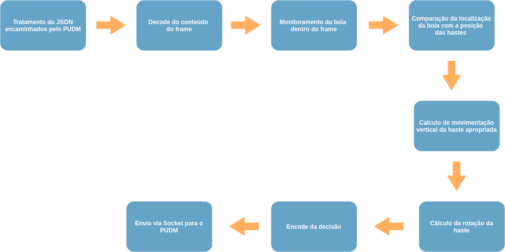

# Work Breakdown Structure

## Dicionário

### 1.0 Software para Mesa de Pebolim para Treinamento

#### 1.1 PUDM

O Pebolim Unified Data Model (PUDM) é uma modelagem de dados criada para permitir a utilização de diversos Machine Controllers na arquitetura da mesa de pebolim. A ideia deste modelo de dados surge a partir do conceito de Interface nas linguagem de programação orientadas a objetos, onde esta representa uma estrutura que funciona como um contrato, garantindo que as classes que a pertencem implementem determinados métodos. O PUDM faz este papel de contrato, porém para os sistemas envolvidos na mesa de pebolim automatizada, governando como deve ser feita a comunicação entre o controlador desta mesa com o Servidor de Decisão e garantindo a compatibilidade entre os sistemas.

##### É/Não É

##### Pacotes de trabalho
- 1.1.1 Definição de padrão de comunicação: Definir qual formato de comunicação e qual o padrão a ser utilizado entre o cliente e o servidor do PUDM
- 1.1.2 Definição de requisitos para compatibilidade de implementação: Definir quais são as funções necessárias para que um sistema seja compatível com o PUDM

#### 1.2 Controlador de Máquina

O Controlador de Maquina representa o componente que interage diretamente com os motores na mesa de pebolim. É responsável por converter os comandos recebidos do Servidor de Decisão em movimentos na mesa. Além disso, é responsável por coletar os dados físicos e enviar para o Servidor de Decisão. Implementa o lado cliente do PUDM.

##### É/Não É

##### Pacotes de trabalho

#### 1.3 Servidor de Decisão

O Servidor de Decisão do Pebolim é a camada responsável por receber os dados encaminhados pela interface PUDM e realizar inferências de controle a partir desses dados com os estados disponibilizados pelo Machine Controller da mesa. A ideia de criar um serviço independente para fazer decisão e usar uma interface para interagir diretamente com comandos de controle é tirar a responsábilidade de formatação e adaptação de dados e garantir uma responsábilidade única por camada dentro do projeto. No caso o servidor de decisão seguiria a seguintes etapas:

figura 1: fluxo principal do servidor de decisão.

Como abordado na figura acima, o servidor começa tratando os dados encaminhados pela interface para o padrão adequado ao processamento. Como estamos lidando com dados gerados por vídeos, é encaminhado os dados através de um JSON contendo a posição das hastes e o frame atual gerado. Quando é feito o decode da image, é aplicado um algoritmo de rastreamento usando técnicas de visão computacional, onde é estimada a posição da bola através dos histórico de frames encaminhados durante o jogo de Pebolim. 

Com a posição da bola e os dados da posição da haste, é analisado a distância de ambos e um calculo de trajetória é estimado. Com os cálculos realizado, é possível designar uma direção para a haste mais próxima a bola localizada e é levantado a possibilidade de rotação do eixo da haste para contra ataque. Após a execução de todo o fluxo, é feito um encode de todos  os dados recolhidos nas etapas descritas anteriormente e uma nova mensagem é encaminhada de volta para a interface de controle com os novos comandos a serem designados aos motores.

<!-- criando um workflow dentro da estrutura, onde a cada camada os dados encaminhado são lapidados até que o formato seja adequado e processado da forma correta para que a mesa responda da forma adequada no campo.  -->

##### É/Não É

##### Pacotes de trabalho
