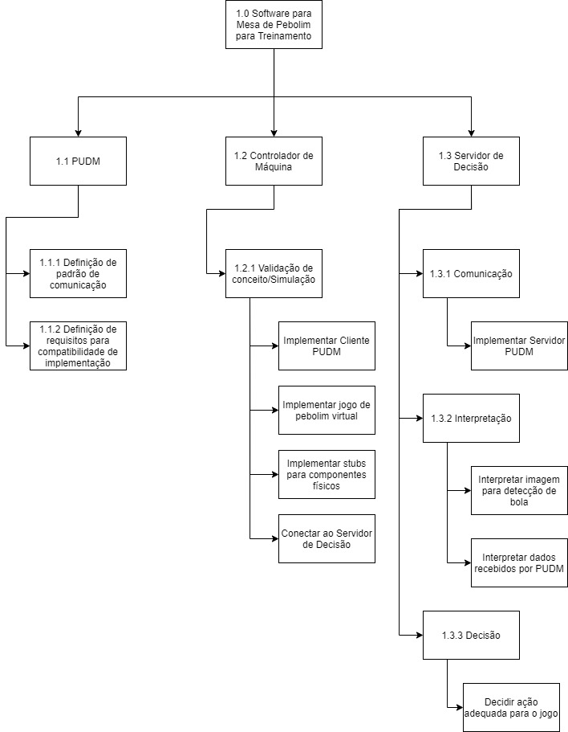

# Work Breakdown Structure

## Dicionário

### 1.0 Software para Mesa de Pebolim para Treinamento

#### 1.1 PUDM

O Pebolim Unified Data Model (PUDM) é uma modelagem de dados criada para permitir a utilização de diversos Machine Controllers na arquitetura da mesa de pebolim. A ideia deste modelo de dados surge a partir do conceito de Interface nas linguagem de programação orientadas a objetos, onde esta representa uma estrutura que funciona como um contrato, garantindo que as classes que a pertencem implementem determinados métodos. O PUDM faz este papel de contrato, porém para os sistemas envolvidos na mesa de pebolim automatizada, governando como deve ser feita a comunicação entre o controlador desta mesa com o Servidor de Decisão e garantindo a compatibilidade entre os sistemas.

##### É/Não É

##### Pacotes de trabalho
- 1.1.1 Definição de padrão de comunicação: Definir qual formato de comunicação e qual o padrão a ser utilizado entre o cliente e o servidor do PUDM
- 1.1.2 Definição de requisitos para compatibilidade de implementação: Definir quais são as funções necessárias para que um sistema seja compatível com o PUDM

#### 1.2 Controlador de Máquina

O Controlador de Maquina representa o componente que interage diretamente com os motores na mesa de pebolim. É responsável por converter os comandos recebidos do Servidor de Decisão em movimentos na mesa. Além disso, é responsável por coletar os dados físicos e enviar para o Servidor de Decisão. Implementa o lado cliente do PUDM.

##### É/Não É

##### Pacotes de trabalho

#### 1.3 Servidor de Decisão

O Servidor de Decisão é onde fica alocada a inteligencia artificial responsável por controlar parte da mesa de pebolim. Ele recebe as informações do Controlador de Maquina, como imagem e status dos motores, processa estes dados e decide em uma ou mais ações recomendadas. Implementa o lado servidor do PUDM.

##### É/Não É

##### Pacotes de trabalho
